# 目录

- [项目拆解](#项目拆解)

- [友邦保险](#友邦保险)

- [标签体系建设](#标签体系建设)

- [我想深入了解，你在这个项目中具体负责了哪些工作？能否详细描述一下你是如何与业务部门对接需求的？](#我想深入了解你在这个项目中具体负责了哪些工作能否详细描述一下你是如何与业务部门对接需求的)

- [标签分类体系设计](#标签分类体系设计)

- [行为偏好类标签](#行为偏好类标签)

- [RFM模型](#rfm模型)

- [用户生命周期标签](#用户生命周期标签)

- [模型设计](#模型设计)

- [为什么设计竖表存储横表应用的架构](#为什么设计竖表存储横表应用的架构)

- [竖表与宽表怎么设计的](#竖表与宽表怎么设计的)

- [具体的竖表设计](#具体的竖表设计)

- [流程优化](#流程优化)

- [标签综合优化](#标签综合优化)

- [Bitmap 为什么快，](#bitmap-为什么快)

- [什么时候设计？](#什么时候设计)

- [标签治理](#标签治理)

- [1. 热度值计算模型](#热度值计算模型)

- [2. 预警机制实施](#预警机制实施)

- [自动化测试与质量保障：](#自动化测试与质量保障)

- [数据存储治理](#数据存储治理)

- [冷热数据分离](#冷热数据分离)

- [模型与生命周期](#模型与生命周期)

- [小文件治理](#小文件治理)

- [数据质量治理：](#数据质量治理)

# 项目拆解

# 友邦保险

为满足友邦保险精准营销、风险管控及客户精细化运营需求，基于友邦保险业务数据仓库构建客户画像标签平台。通过整合客户基本信息、保单数据、理赔记录、健康问卷等多维数据，抽象提炼客户全貌特征，实现客户属性标签化，应用于精准营销、产品推荐、风险评估、客户服务优化等场景，助力业务部门提升客户转化率、降低理赔风险、增强客户粘性，推动公司业务高质量发展。  
  
个人职责：  
  
标签体系建设：深度对接营销、客服、精算等业务部门，梳理客户全程标签需求，完成相应的标签开发和数据验证，覆盖基础属性（年龄、职业、地域）、行为偏好（投保渠道、产品偏好）、价值评估（LTV、续保倾向）、风险特征（健康风险等级、理赔历史）等维度，构建客户360°画像标签体系  
模型设计：设计“竖表存储+横表应用”混合架构，在DM层采用竖表结构存储标签原子数据，提升标签扩展性和维护效率，在ADS层根据标签分类将多标签拼接为宽表，优化查询性能  
引入Doris作为标签服务存储层，完成相关的用户行为分析和客群圈选，提升70%的查询性能；对于合适标签添加Bitmap位图索引提升多标签组合查询性能。  
流程优化：参与制定标签开发规范，包括一致性规则，需求流程规范，引入标签开发需求评审，充分评估需求背景和需求价值，维护标签源数据信息到标签平台，避免标签过度开发和重复开发  
标签治理：参与建设标签评价体系，从用户覆盖率、准确率、使用频率等综合评估标签，参与制定标签生命周期管理，推行热度值预警机制，对占用系统资源的低价值标签进行公示和下线处理  
自动化测试与质量保障：搭建标签计算任务的自动化测试框架，覆盖边界值、异常数据、性能压力等测试场景，通过单元测试与集成测试保障标签计算逻辑的准确性，标签产出可用性提升至98%  
数据质量治理：基于DQC与任务级SLA监控规则50+，覆盖分区数据量激增，空值率超出阈值等核心场景；建立异常自动告警熔断机制，异常响应时间缩短到10分钟内，数据链路稳定性提升至99.9%  
数据存储治理：根据模型分区与生命周期配置，对冷热数据进行分离，小文件治理等减少存储成本  
数据算力治理：梳理集群算力优化治理方向，制定具体解决方案，包括数仓核心任务编排错峰生产，建立任务编排机制；数仓TopN大资源任务治理；周失败超3次和月失败超5次的异常任务治理；结合元数据和血缘进行分析下线无用任务等  
Doris的开发与优化：针对Doris及其他组件的生产告警、资源占用异常、Doris异常排查、表模型设计以及达标查询性能等问题，进行深入分析与解决。最终沉淀成公司文档，定期内部培训提升整体Doris使用能力  
项目成果：  
  
标签体系全覆盖保险注册用户，累计生产200+业务可用标签  
利用物化视图缓存指标，查询秒级响应，冷热分离存储策略使存储成本降低50%  
下线**无效模型-技术经验，业务价值**，提高标签整体的使用效率和产出价值，降低生产成本和存储成本

**友邦保险业务过程**

简单来说，友邦的业务流程主要可以分为四大核心阶段：投保（录入）、核保（风控）、缴费（支付）与 保单服务（存续/理赔）。

**渠道分为 个人，企业，移动端，网页版**

**人寿保险**：提供身故保障基础，包括定期寿险、终身寿险及两全保险，如《友邦双盈人生Ⅱ终身寿险》，在被保险人身故时向受益人支付保险金，保障家庭财务安全。

**健康保险**：覆盖疾病与医疗风险，包括重疾险、医疗险和意外险，如《友邦智选逸生医疗保险》采用"核心保障+个性化配置"模式，最高提供500万元年度赔付限额，解决高额医疗费用负担。

**养老保险**：提供退休后稳定现金流，包括年金保险和个人养老金产品，如《友邦优享年年年金保险》可在退休后提供长达20年的稳定年金，助力"老有所养"。

**储蓄保险**：兼具保障与资金积累功能，包括两全保险和分红型产品，如《友邦盈御多元货币计划》提供9种货币选择，支持保单货币转换，实现财富稳健增值。

**财富管理保险**：满足资产配置需求，包括增额终身寿险和投资连结保险，如《传世经典荣耀2024》通过分红机制实现财富增长，适合高净值人群进行资产规划与传承。

特色保险服务：创新"保险+服务"模式，如"愈从容"重疾专案管理服务和"旅居养老"生态圈，提供从疾病筛查到康复的全程陪诊及全国7座城市23个旅居养老套餐，实现保障与服务的深度融合。

## 标签体系建设

标签体系建设：深度对接营销、客服、精算等业务部门，梳理客户全程标签需求，完成相应的标签开发和数据验证，覆盖**基础属性**（年龄、职业、地域）、**行为偏好**（投保渠道、产品偏好）、**价值评估**（LTV、续保倾向）、**风险特征**（健康风险等级、理赔历史）等维度，构建客户360°画像标签体系

### 我想深入了解，你在这个项目中具体负责了哪些工作？能否详细描述一下你是如何与业务部门对接需求的？

在需求对接阶段，我是项目组中对接业务部门的接口人，每周二、四下午我们会分别与**营销**部门，客服中心的**客户运营**团队，及**精算**团队，进行需求会议，比如，与营销对接的时候，他们提出想精准识别高潜力的客户的需求时，我们需要继续追问，什么是高潜力客户，是基于历史保费，产品偏好,还是其他行为指标？通过这样的深度沟通，我最终把他们的模糊需求转换为具体的技术需求。

其次标签开发环节，我负责了全部标签开发，以投保渠道偏好标签举例，我设计了个加权算法，-用户近三次投保中，线上渠道60%，代理人40%，那么该用户渠道偏好就线上为主，代理人辅助，这个算法经过3轮迭代最终精确率92%

数据验证方面，我建立了一套完整的验证机制，对于健康风险等级标签，我不仅做了技术层面的数据一致性验证，更与精算部门合作进行业务验证，我们抽样10k 样本客户，将标签预测结果与实际理赔情况进行对比，发现标签准确率89%，超过业务部门85%预期

最后我特别注重标签的业务价值闭环，每次标签上线后，我都会追踪其使用效果，例如续保倾向标签上线后，营销团队用它进行精准触达，续保率提升18%，这也是我在项目中最有成就感的部分

### 标签分类体系设计

我们友邦建立了四层标签体系分类体系，这是经过深度业务分析后的架构设计

标签分为，**基础属性，行为偏好，价值评估，风险特征**

第二层，基础属性：人口属性，社会属性和自然属性。年龄，职业地域呀，

行为偏好分为，具体的用户行为，例如投保行为，渠道使用习惯等

价值评估为用户购买保单产生的的价值，例如续保率LTV客户终身价值，获取一个客户最终带来多少价值。

最后是风险特征，客户本身的存在的风险，例如健康风险，理赔历史等维度

我说负责的是客户域。

### 行为偏好类标签

**投保偏好标签**：根据时间衰减算法进行计算，权重是一个指数图，越近的权重越大，越远权重越小，计算规则是行业内通用的 取0.8^(月数差/6) 算出每次投保的权重值\*金额，后最近对比线上下线得分取最大的值。**当数值误差10%**时打混合渠道标签

**产品类偏好**（保守型vs理财型）

保障型：重疾险，医疗险，意外险，定期寿险

理财型产品清单：年金险，分红险，投连险

单个产品权重 = 保费金额 × e^(-0.02 × 月数差)

保障型>65% 理财型<35% 其余平衡型

**投保决策偏好**（快决策，慢决策）

决策速度得分 =

0.3 × (1 - 页面平均停留时间/30分钟) + \# 时间维度

0.4 × (1 - 咨询到投保天数/90天) + \# 时长维度

0.2 × (1 - 产品对比次数/5次) + \# 对比维度

0.1 × (1 - 代理人沟通轮次/10次) \# 沟通维度

标准化到0-100分： 快决策：80-100分 中决策：50-79分 慢决策：0-49分

### RFM模型

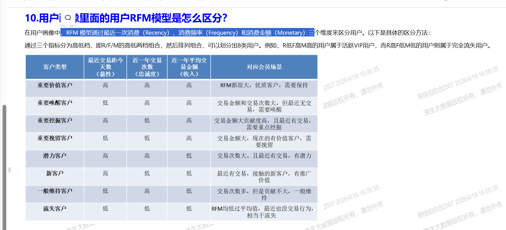

### 用户生命周期标签

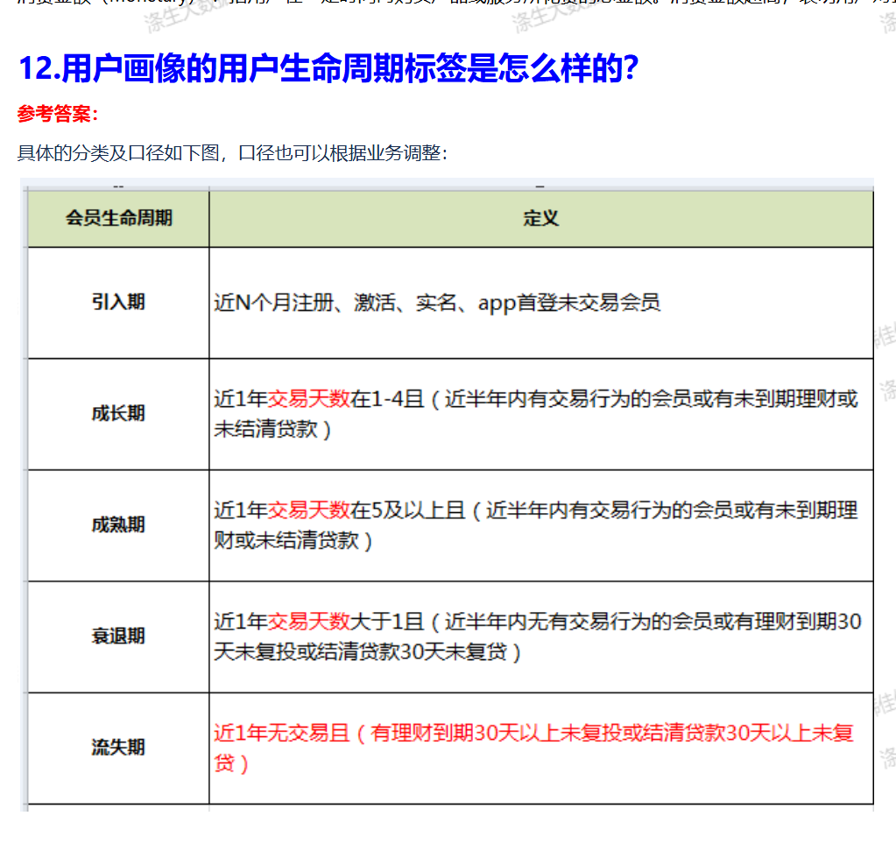

## 模型设计

模型设计：设计“竖表存储+横表应用”混合架构，在DM层采用竖表结构存储标签原子数据，提升标签扩展性和维护效率，在ADS层**根据标签分类**将多标签拼接为宽表，优化查询性能

### 为什么设计竖表存储横表应用的架构

因为友邦保险是个业务需求变化特别快的公司，营销部门经常新增行为标签，例如疫情期间要快速上线线上服务偏好，健康关注指数等标签，精算部门要根据新出的保险产品调整风险评估标签等，不同标签计算频率不同，导致计算完成时间不同，如果只用横表，会由于最后计算完的标签，导致生成的时间很晚，同时一个user 并不一定有所有标签，会导致存储的稀疏。竖表对计算层友好，横表对查询层友好

### 竖表与宽表怎么设计的

基础标签会存入**竖表**-例如基本属性，行为属性价值属性，跟风险属性，

应用标签，**横表**处理，集团会员基础信息标签，支付会员基础信息标签，保险会员基础信息标签-一般会预留字段，帮助扩展后续标签

最后为了更方便的查询及导出数据，需要按业务线拼接成各自的业务线**宽表**-用户基本信息标签表，-用户行为标签表，用户价值标签表，用户风险标签表。

### 具体的竖表设计

CREATE TABLE dm_tag_atom (

customer_id STRING COMMENT '客户唯一标识',

tag_namespace STRING COMMENT '标签命名空间，如behavior.preference',

tag_key STRING COMMENT '标签键，如channel_pref',

tag_value STRING COMMENT '标签值，如online/offline/mixed',

tag_type STRING COMMENT '标签类型：base/behavior/value/risk',

tag_version STRING COMMENT '标签版本，用于灰度发布',

data_source STRING COMMENT '数据来源：policy/claim/behavior_log',

update_time TIMESTAMP COMMENT '最后更新时间',

valid_from TIMESTAMP COMMENT '生效开始时间',

valid_to TIMESTAMP COMMENT '生效结束时间',

confidence_score DOUBLE COMMENT '置信度分数，0-1' ) --客户投保记录不足3条时<0.7

PARTITIONED BY (dt STRING) STORED AS ORC;

横表就是4种表关联就行了

## 流程优化

参与制定标签开发规范，包括一致性规则，需求流程规范，引入标签开发需求评审，充分评估需求背景和需求价值，维护标签源数据信息到标签平台，避免标签过度开发和重复开发

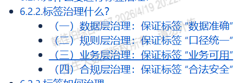

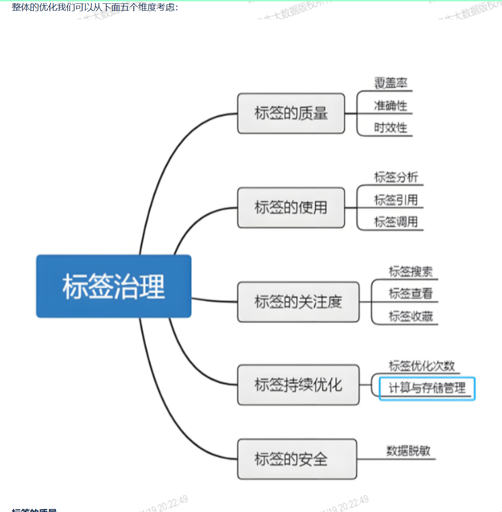

## 标签综合优化

引入Doris作为标签服务存储层，完成相关的用户行为分析和客群圈选，提升70%的查询性能；对于合适标签添加Bitmap位图索引提升多标签组合查询性能。

位图放在Doris 层

根据更新频率来区分位图索引表

缺点更新代价高，用户增减时需要重构位图，不适合明细查询，只能判断是否存在

### Bitmap 为什么快，

1.天然去重，寻址时间复杂度O(1)，而不是O(n)

2.取交集，就能找到对应的客群，3.存储还省空间

局限性，值必须整数，唯一性，不适合稀疏存储

### 什么时候设计？

高基数去重场景： 如计算日活（DAU）、月活（MAU）。COUNT(DISTINCT user_id) 在数据量大时极慢且消耗内存，Bitmap 可以将查询时间从几十秒降低到毫秒级。

多维圈选/用户画像： 比如“找出 既是‘男性’ 又买了‘重疾险’ 且 年龄>30 的用户”。Bitmap 的交集（BITMAP_INTERSECT）运算速度极快。

留存分析： 计算次日留存、七日留存等

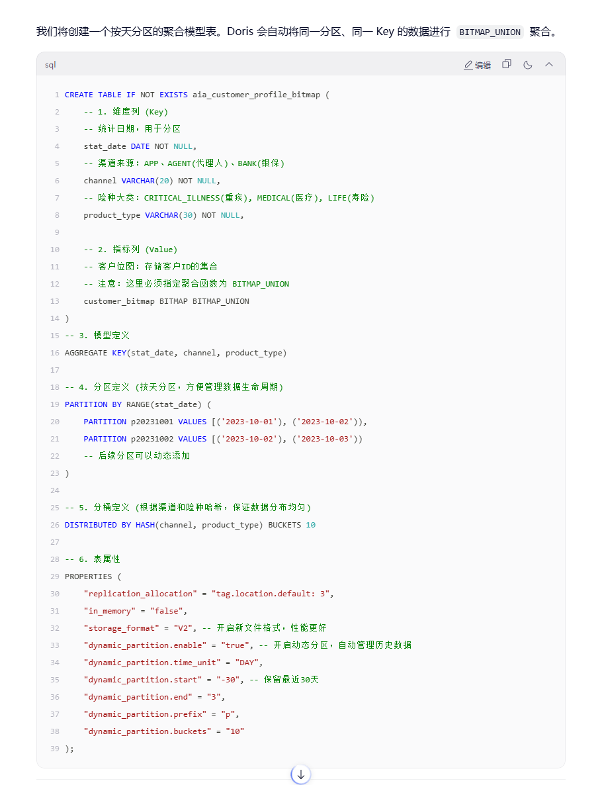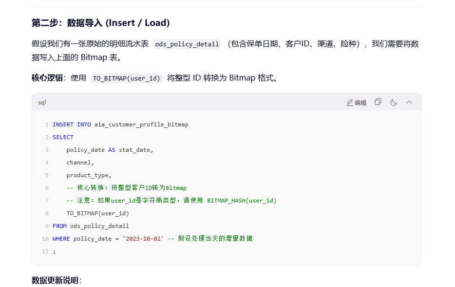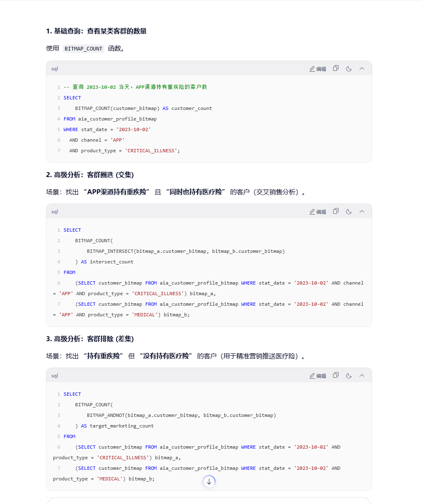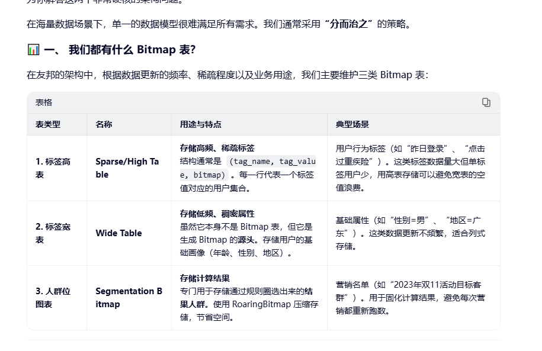

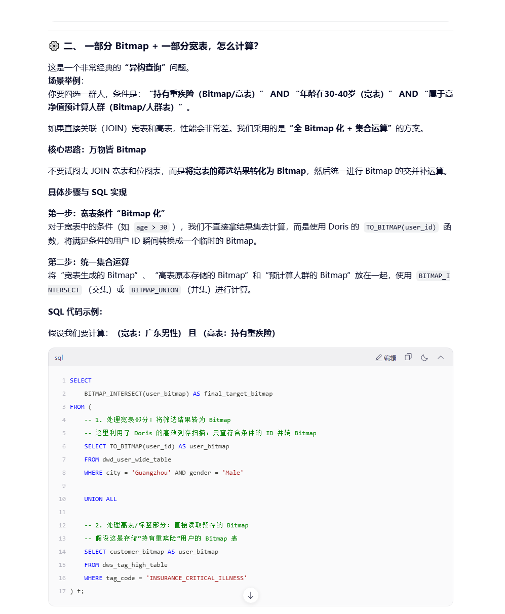

## 标签治理

参与建设标签评价体系，从用户覆盖率、准确率、使用频率等综合评估标签，参与制定标签生命周期管理，推行热度值预警机制，对占用系统资源的低价值标签进行公示和下线处理

**标签价值指数** = 0.3×覆盖率 + 0.3×准确率 + 0.2×使用频率 + 0.2×业务价值权重

**价值分级管理**：将标签分为A（价值指数≥0.8）、B（0.6-0.8）、C（0.4-0.6）、D（<0.4）四级，实施差异化管理

### 1. 热度值计算模型

热度值=0.5×近期**使用频率** + 0.3×**业务价值权重** + 0.2×**用户覆盖率**

动态阈值设置：根据业务场景设置不同热度阈值，如营销场景阈值为0.6，风控场景阈值为0.7

热度趋势分析：监测标签热度变化趋势，识别潜在价值下降风险

### 2. 预警机制实施

三级预警体系：

黄色预警：热度值低于阈值10%以内，触发提醒

橙色预警：热度值低于阈值10%-20%，触发整改

红色预警：热度值低于阈值20%以上，触发下线评估

## 自动化测试与质量保障：

搭建标签计算任务的自动化测试框架，覆盖边界值、异常数据、性能压力等测试场景，通过单元测试与集成测试保障标签计算逻辑的准确性，标签产出可用性提升至98%

实现测试资源压力测试，同时保证生产环境测试对于生产数据0污染，引入大模型，自动生成测试用例，

测试策略分层覆盖，持续验证，每天自动回归测试

数据业务测试，AB测试，推行你构建，你运维的职责制，成立跨部门数据治理委员会，制定标签计算质量标准与评审流程。

定期开展数据质量复盘工作坊，通过根因分析沉淀组织过程资产。

## 数据存储治理

根据模型分区与生命周期配置，对冷热数据进行分离，小文件治理等减少存储成本

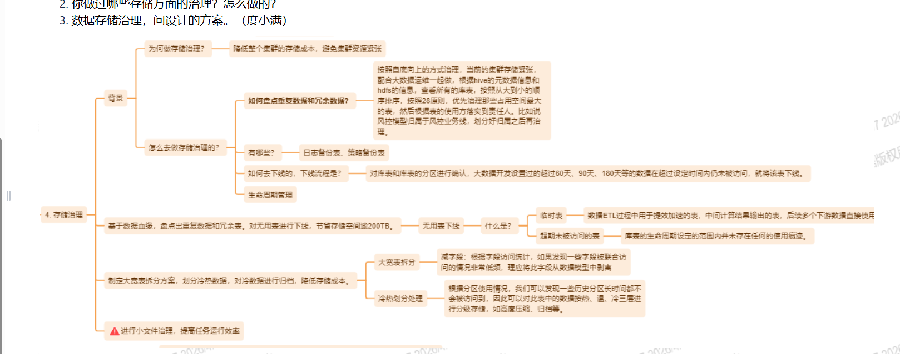

### 冷热数据分离

制定大表拆分方案，冷数据归档，降低存储成本

根据分区历史数据按照冷温热三层分级存储，高度压缩，归档

热数据：最近7天数据，占查询量的80%，需高性能访问

温数据：7-30天数据，查询频率中等

冷数据：30天以上数据，仅占查询量5%，访问频率低

热数据层（0-7天）：LZ4/Snappy轻量压缩，存储在SSD

温数据层（7-30天）：ZSTD(3)平衡压缩，存储在云硬盘

冷数据层（30天以上）：ZSTD(10)/Gzip高压缩，存储在对象存储

### 模型与生命周期

**表的分类分级主要从业务价值、数据敏感度、使用频率和技术特征四个核心角度进行区分，通过多维度评估实现数据资源的精细化管理与价值最大化。**

**存量**

对所有生产表结合公司资源管理平台，进行分类分级标记识别，（元数据，跟算法策略批量标记）

结合表的分类分级策略，

以及数仓每个层的存储策略-

**以及表的使用元数据分析情况，**

**对所有生产表进行**生命周期配比和优化，

对所有临时表统一配置45天默认生命周期管理策略

**新增，**

新增模型按照新的分类分级和生命周期管理策略进行实施

**监控机制**

建立表存储管理 的闭环机制，例如核心模型上线前需要组内check review，通过公司平台统一建表管理

建立表的使用情况的监控分析，比如表的应用分析和生命周期不一致的监控，每周统计看板，梳理出异常模型，联系开发人员进行确认和治理

建立规范落地的考核机制

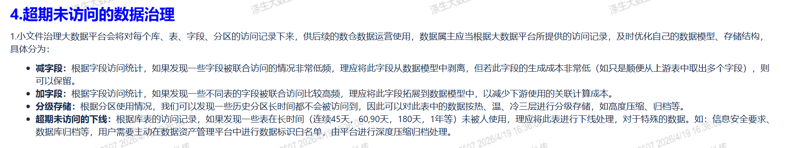

数仓表的生命周期没有所谓的统一落地标准，主要是结合业务需求以及存储成本综合考量的。有些公共参考标准，比如**一般建议dwd永久保存**，**因为这是公司最原子的数据，公司最原始的数据资产，一般建议永久备份**，但是时间久了其实数据也没啥业务价值。比如保留3年，5年的数据，**这个时候即使保留，我们也会选择冷热备份，**归档备份机制等，目的就是了降低存储成本。比如2副本存储，归档机存储，光盘磁盘介质存储等。所以即使DWD的数据在很多企业也不是一定永久存储，实际企业可能考虑到成本，结合业务使用的情况，数据的价值，适当缩短生命周期。

**dws层，ads层一般都是配置生命周期的，结合业务的使用情况，业务比如需要使用3年，那可能保留3年半，比如业务可能使用18个月就够了，保留20个月这样子。**

其他dwd,dws,ads层我们可以结合表的调用情况以及业务的数据周期需求，综合考量配置生命周期。比**如某个表我们监控到只调用最近6个月最新分区，那么业务说保留2年，这明显不合理，这种情况下需要他们详细说明保留的必要性，如果确实需要保留那就注明原因，否则可能要进一步确认生命周期。**

### 小文件治理

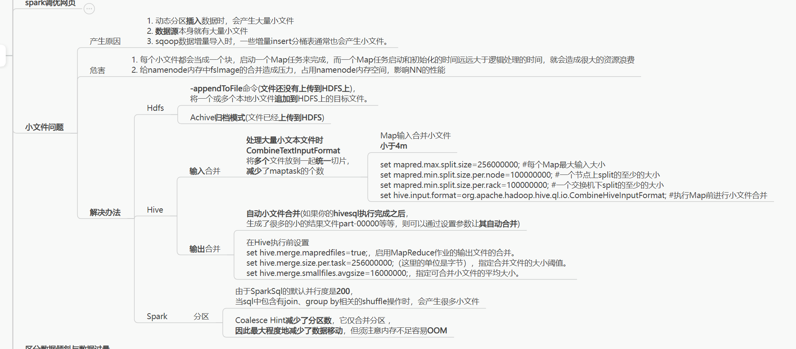

单个文件分区数大于10个，且平均文件大小小于32MB 的文件

## 数据质量治理：

基于DQC与任务级SLA监控规则50+，覆盖分区数据量激增，空值率超出阈值等核心场景；建立异常自动告警熔断机制，异常响应时间缩短到10分钟内，数据链路稳定性提升至99.9%

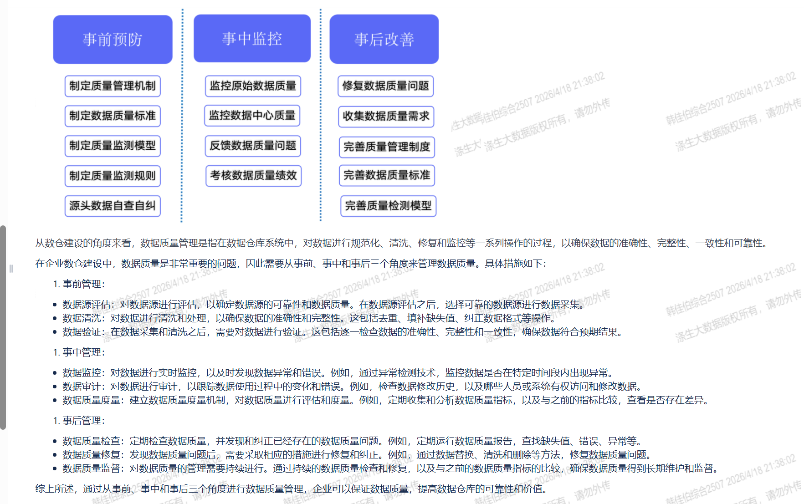

事前检查，事中实时监控监控，数据质量度量，指标对比，事后验证DQC

规则执行机制：

强规则：触发即阻断任务执行，将任务置为失败状态，防止问题数据流入下游（如空值率>5%、表行数波动>30%）

弱规则：仅触发多渠道告警（邮件、短信、钉钉、企业微信），不影响任务继续执行

动态阈值：基于历史数据波动自动调整阈值，避免固定阈值导致的误报

**数据算力治理：**

梳理集群算力优化治理方向，制定具体解决方案，包括数仓核心任务编排错峰生产，建立任务编排机制；数仓TopN大资源任务治理；周失败超3次和月失败超5次的异常任务治理；结合元数据和血缘进行分析下线无用任务等

**任务优先级分级体系**，P0 P1 P2  
P0 重要紧急，P1 重要非紧急 P2 非核心

高峰避让+低谷填充机制：

核心业务错峰：将实时数据同步、核心报表等时效性要求高的任务，安排在业务平峰期（如工作日11:00-13:00）

非核心任务低谷执行：日志分析、历史数据清洗等任务统一调度至资源空闲期（如凌晨3:00-5:00）

铁路行业案例：某铁路集团通过将机务检修数据的T-1同步任务安排在凌晨3点执行，彻底避开日间运营高峰

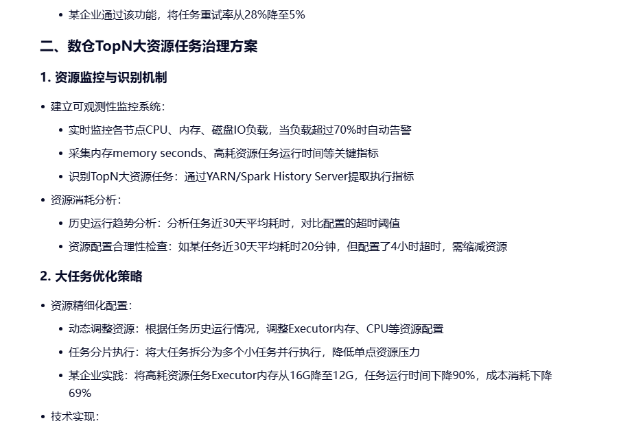

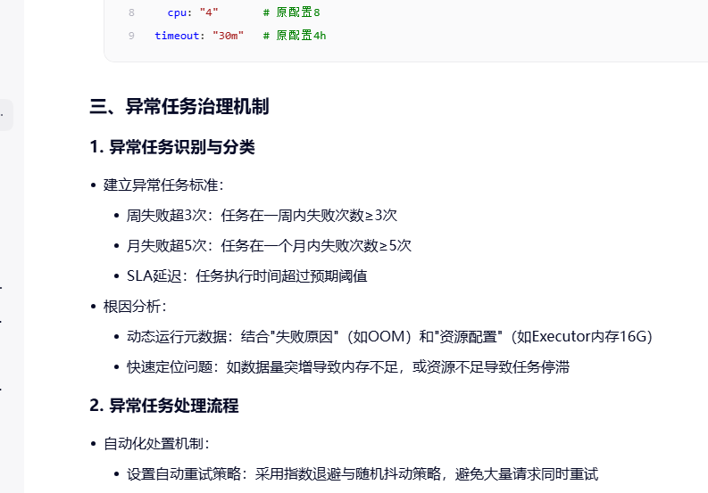

**无用任务下线处理**

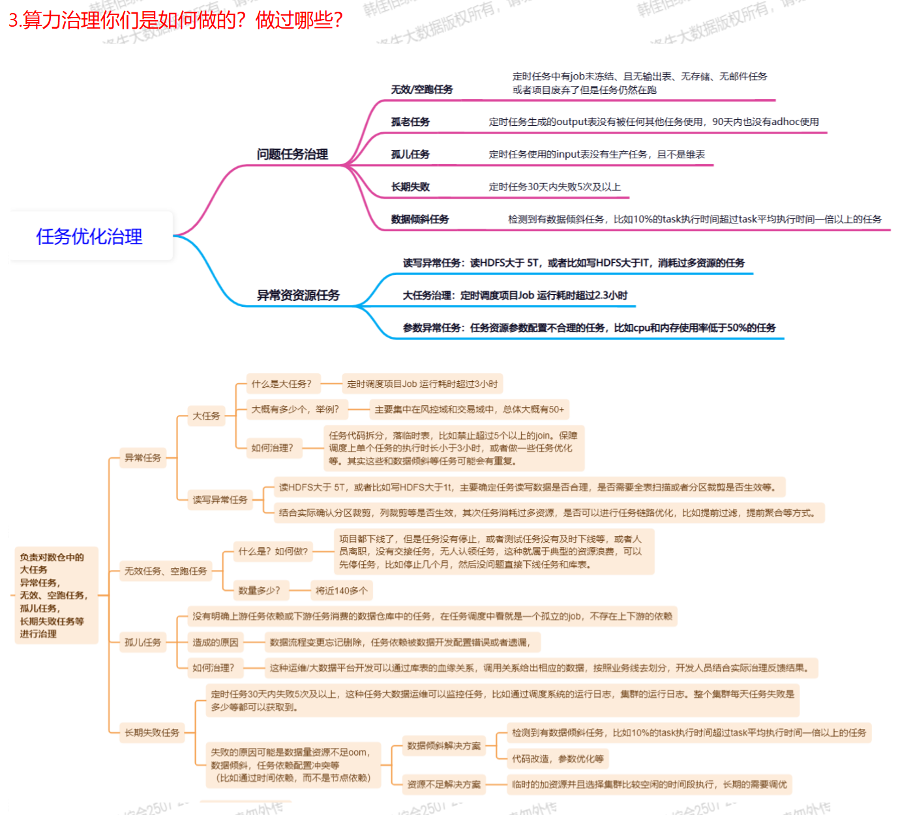

## **Doris的开发与优化：**

针对Doris及其他组件的生产告警、资源占用异常、Doris异常排查、表模型设计以及达标查询性能等问题，进行深入分析与解决。最终沉淀成公司文档，定期内部培训提升整体Doris使用能力

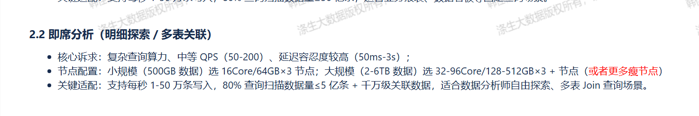

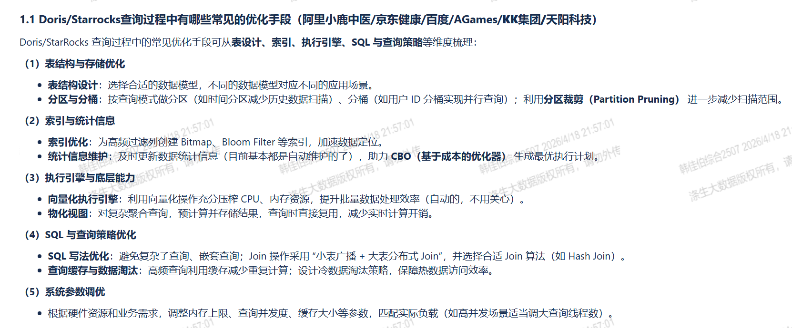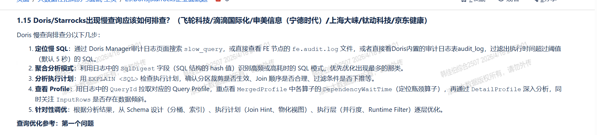

表模型设计标签宽表用聚合模型 用聚合函数，保证最新的有效值，适合低频更新场景，避免全表扫描

高频更新标签设计，用主键模型避免全表扫描，动态更新快

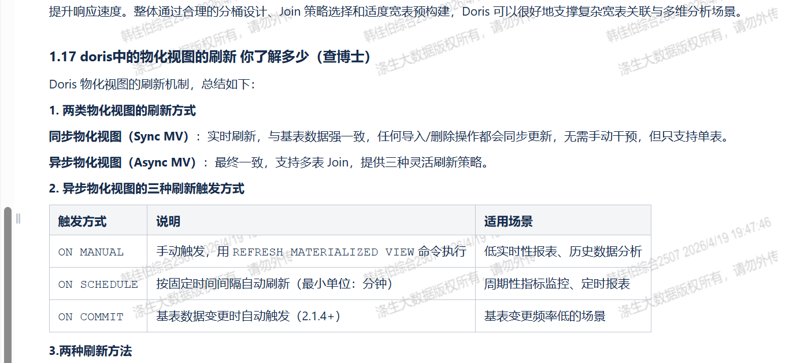

Bitmap类型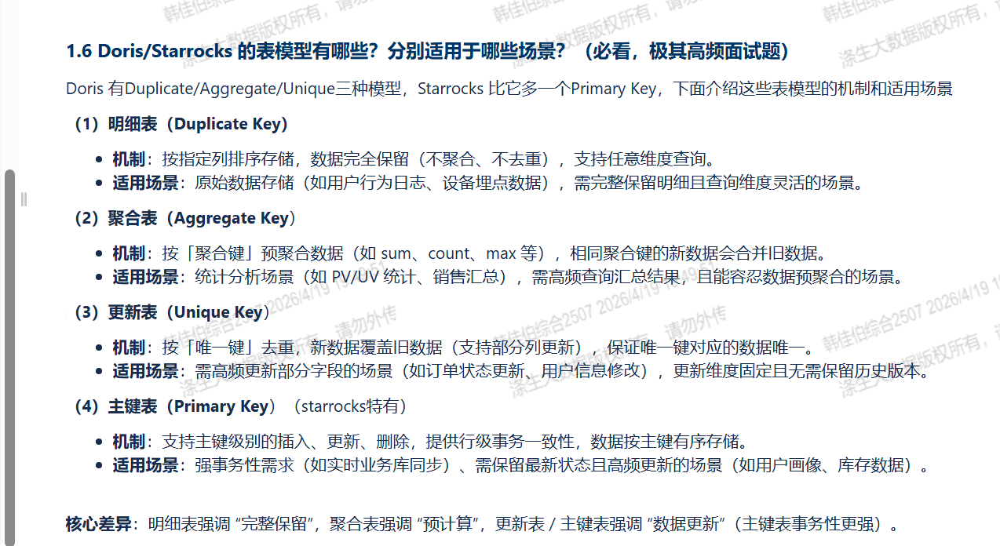

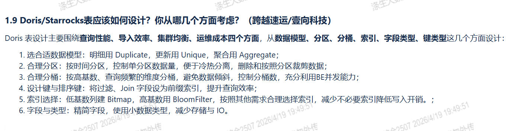哈希映射到位数组，判断“是否存在”

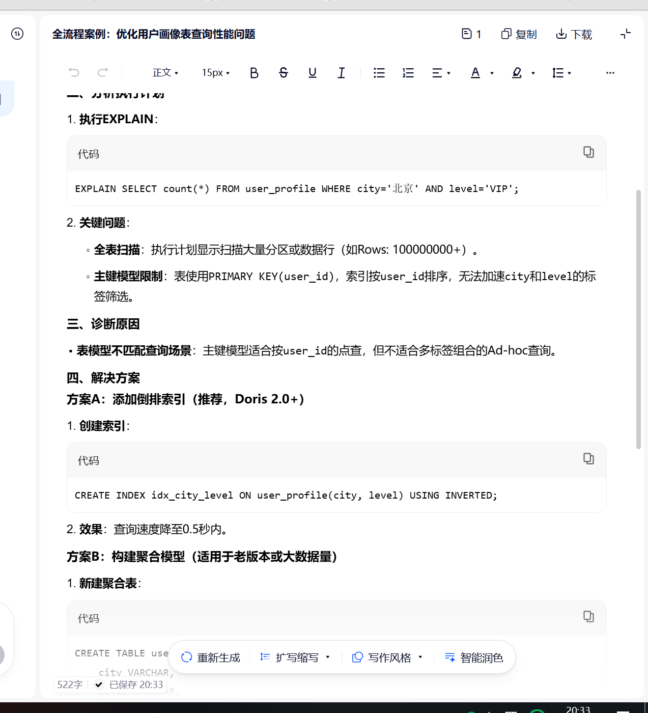

**Doris 索引**

标签组合查询场景，

为city level interest_tags 创建倒排索引，避免全表扫描

高基数ID 查询场景，  
创建BloomFilter索引，性能提升5-10，适合高并发

范围查询，确保age spend_amount 等字段位于排序列前列，用前缀索引加速避免全表扫描

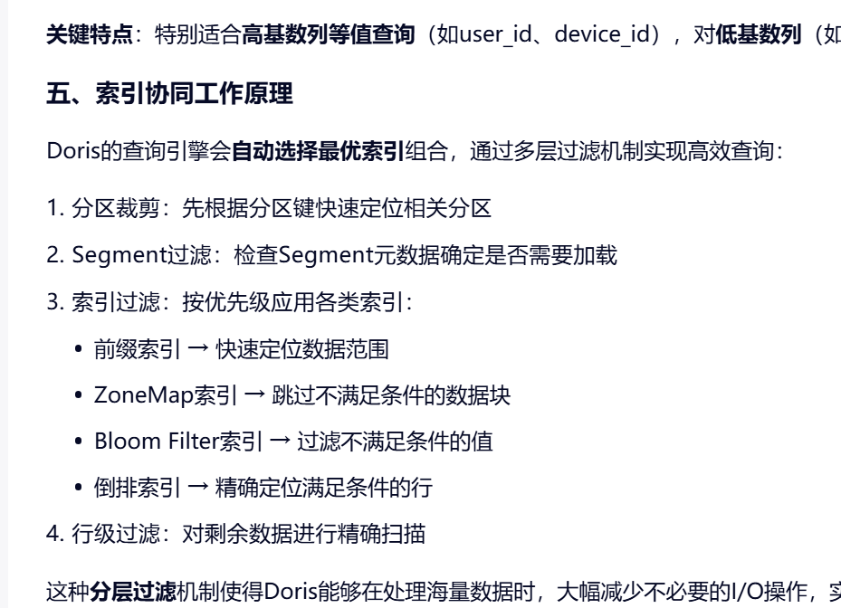
